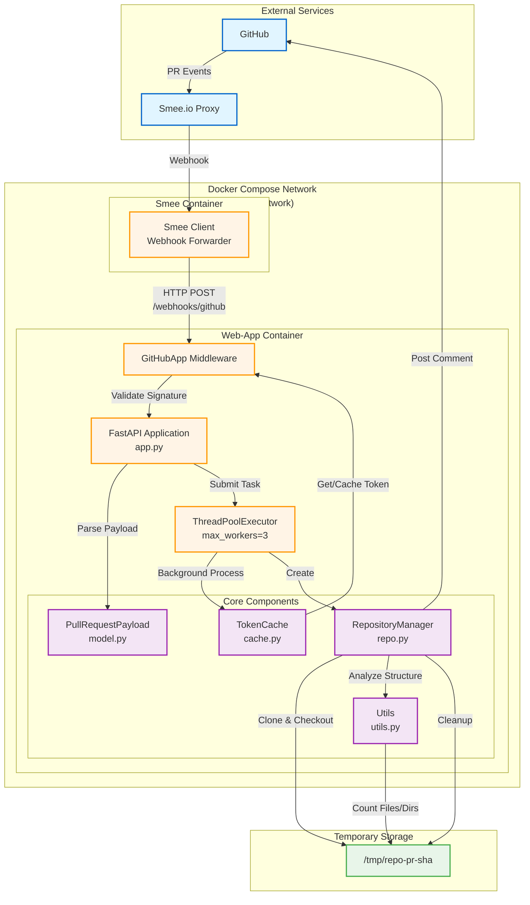
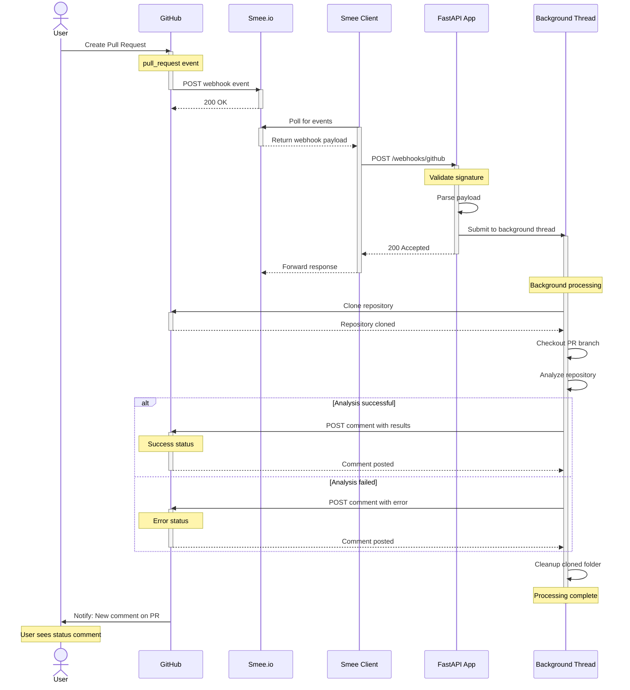
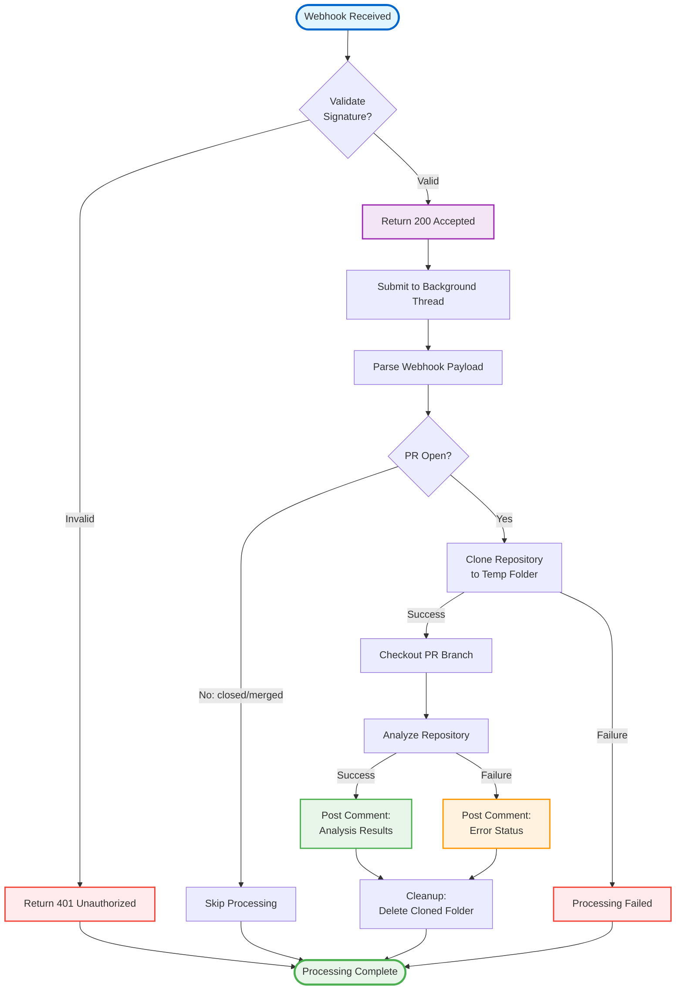
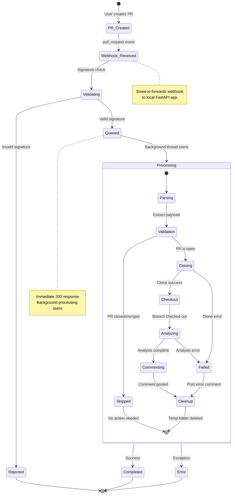

# Architecture Diagrams

## System Architecture

This diagram shows the complete architecture of the GitHub App, including Docker containers, application components, and data flow.

## Pull Request Processing Flow

This sequence diagram shows the high-level flow from when a user creates a pull request to when the bot posts a status comment.

## Background Processing Flowchart

This flowchart shows the high-level process flow when a pull request event is received.

## Pull Request State Diagram

This state diagram shows the lifecycle of a pull request as it's processed by the GitHub App.

## Architecture Components

### 1. Docker Services
Defined in `docker-compose.yaml`:
- **web-app**: FastAPI application container (port 8080:8000)
- **smee**: Webhook proxy container forwarding GitHub events to local app
- **github-app-network**: Bridge network connecting both containers

### 2. Request Flow
1. GitHub sends PR events (opened/synchronize)
2. Events route through Smee.io proxy service
3. Smee container forwards to web-app at `/webhooks/github`
4. GitHubApp middleware validates webhook signature
5. FastAPI handler submits task to background thread pool
6. Background worker processes the PR event

### 3. Background Processing Pipeline
Located in `app.py:54-91`:
1. **Parse Payload** - Extract PR data using PullRequestPayload model
2. **Get Token** - Retrieve cached or fetch new GitHub App installation token
3. **Clone Repository** - Clone to `/tmp/{repo}-{pr_number}-{short_sha}`
4. **Analyze Structure** - Count files and directories (excluding .git)
5. **Post Comment** - Add bot comment to PR with analysis results
6. **Cleanup** - Remove cloned repository from /tmp

### 4. Core Classes

#### TokenCache (`src/cache.py`)
- Thread-safe token caching with threading.Lock
- 5-minute expiration buffer before token expires
- Automatic refresh when expired
- Handles timezone-aware and naive datetime objects

#### RepositoryManager (`src/repo.py`)
- Repository cloning with GitHub App token authentication
- Branch checkout for PR head
- Repository structure analysis
- PR comment posting via GitHub API
- Automatic cleanup after processing

#### PullRequestPayload (`src/model.py`)
- Parses GitHub webhook payload
- Extracts: install_id, repository, branch, commit_sha, PR number, state
- Validates PR is open and not merged/closed
- Provides structured access to webhook data

#### Utils (`src/utils.py`)
- Base64 key decoding for private key
- Datetime parsing with multiple format support
- Repository structure analysis (recursive file/directory counting)
- File I/O utilities

### 5. Environment Configuration
Required environment variables (passed to web-app container):
- `GITHUB_APP_ID` - GitHub App identifier
- `GITHUB_APP_PRIVATE_KEY` - Base64-encoded private key
- `GITHUB_WEBHOOK_SECRET` - Webhook signature validation secret
- `SMEE_URL` - Smee.io proxy URL (for smee container)
- `SMEE_TARGET` - Target URL for webhook forwarding

### 6. Key Features
- **Asynchronous Processing**: ThreadPoolExecutor prevents webhook timeout
- **Token Efficiency**: Caching reduces GitHub API calls
- **Resource Management**: Automatic cleanup of cloned repositories
- **Unique Clone Paths**: Prevents conflicts with commit SHA in path
- **Comprehensive Analysis**: Recursive directory traversal with .git exclusion
